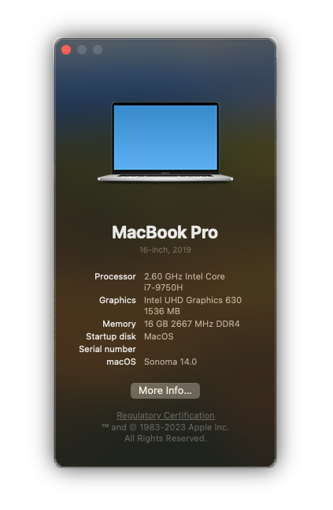

### MSI GL65 9SE Hackintosh

### Hardware
| Component      |Info                                      |
|----------------|------------------------------------------|
| **CPU**        |  Intel Core i7-9750H                     |
| **RAM**        |  Samsung 2x8GB 2666mhz M471AK43CB1-CTD   |
| **Storage**    |  Samsung SSD 970 EVO Plus 1TB            |
| **Screen**     |  15.6" 1920x1080 120hz                   |
| **iGPU**       |  Intel UHD Graphics 630                  |
| **dGPU**       |  Nvidia RTX 2060(disabled)               |
| **Audio**      |  Realtek ALC269                          |
| **Ethernet**   |  Realtek Gigabit Ethernet                |
| **Trackpad**   |  Synaptics                               |
| **WiFi card**  |  Intel(R) Wi-Fi 6E AX210 160MHz          |
| **SD card**    |  Realtek USB 2.0 Card Reader             |
| **Battery**    |  53Wh                                    |

### Status
**Everything works!**

**Except:** `RTX 2060 (No macOS driver support)` and `HDMI (port wired to dGPU)`.

### BIOS Settings
* Reset BIOS to factory default
* Fast Boot and Secure Boot = **Disabled**
* Power & Performance > CPU-Power Management Control > Configure CPU Lock Options > CFG lock = **Disabled**

